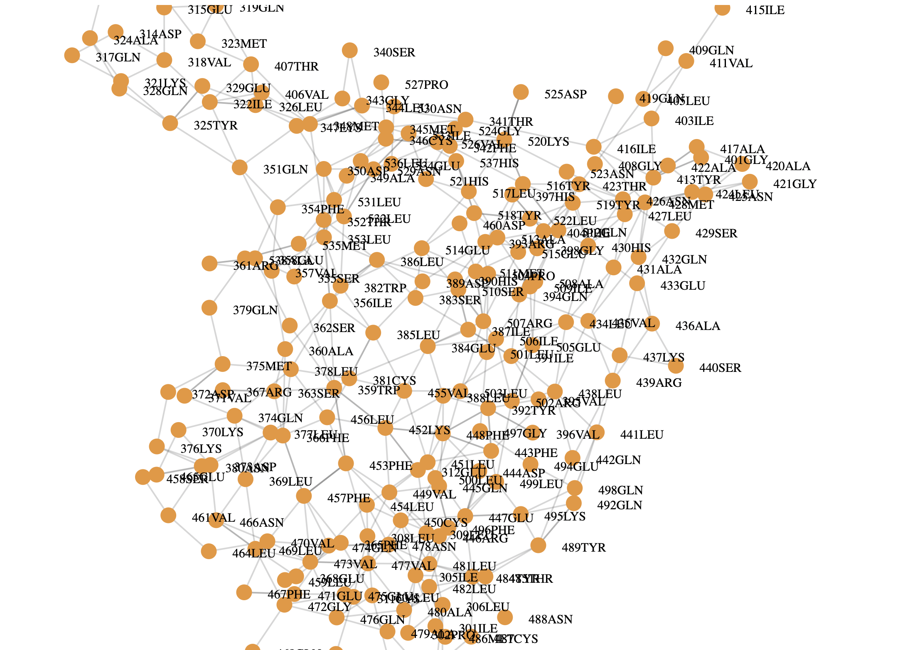

# LCB42 HTML repository (LastCodeBender42.github.io):

This repository stores a group of HTML files that I use on my personal website . I prefer the convenience of using a hosted website for showcasing my experience. However, there are file size restrictions that can be annoying. I work around that limitation by storing HTML files on my .github.io repo and then open the file within an iframe on a hosted web page. For the purposes of developing a personal website this seems time and cost effective.

As an example, I would be unable to host this interactive network visualization natively on my hosted website. 
  
  

  
  
However, I can use an iframe that includes `src=https://LastCodeBender42.github.io/d3graph2.html` and now it works like a charm. See the interactive network viz on my personal website <a href="https://analysisandinformatics.org/d2graph2-html">here</a>. The other advantage is that my personal website becomes a comprehensive introduction to my experience, examples of my code, visualizations, and philosophy. GitHub will continue to serve as the go-to source for storing Dash and Pyside6 apps.

Please, take a moment to review my profile at my personal website <a href="https://analysisandinformatics.org/home">Data Analysis and Bioinformatics</a>.

